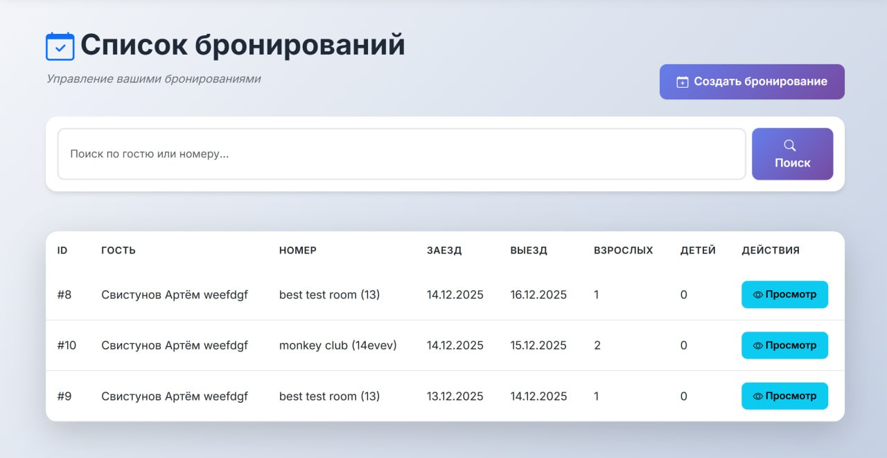
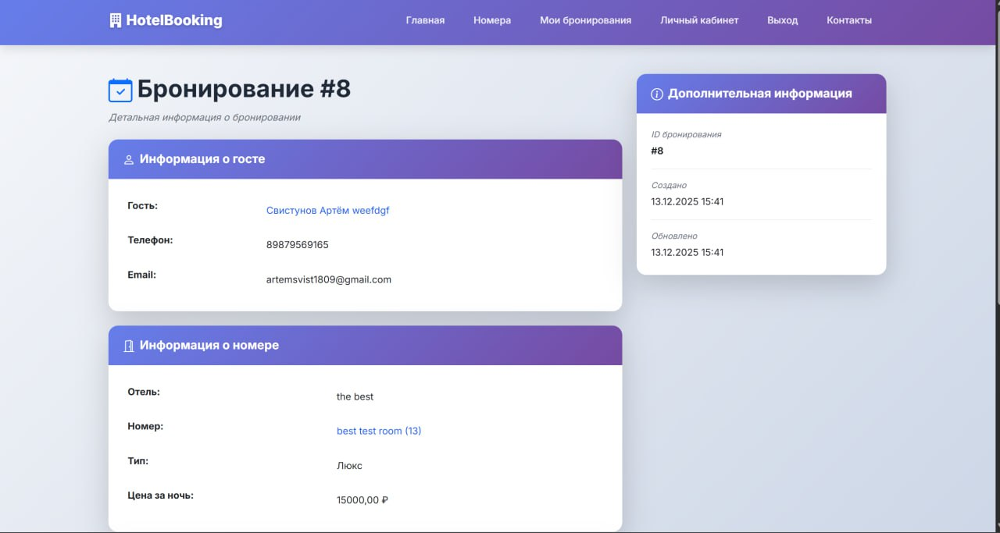
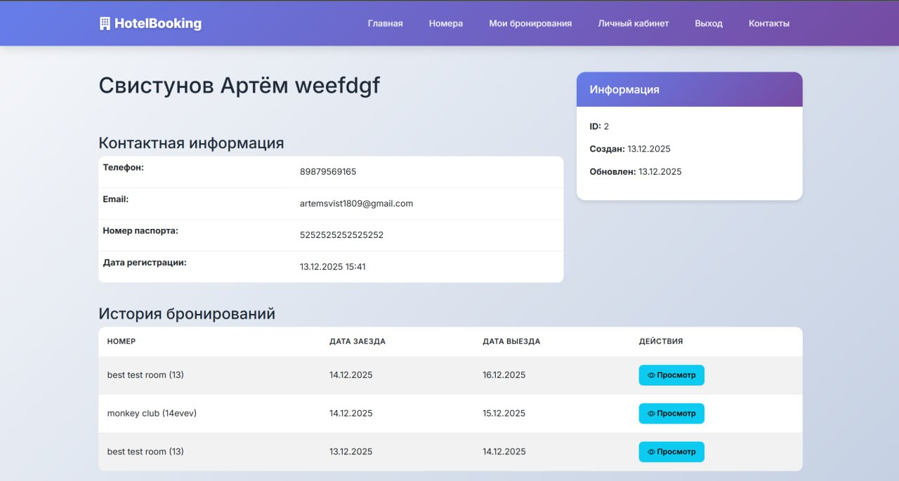
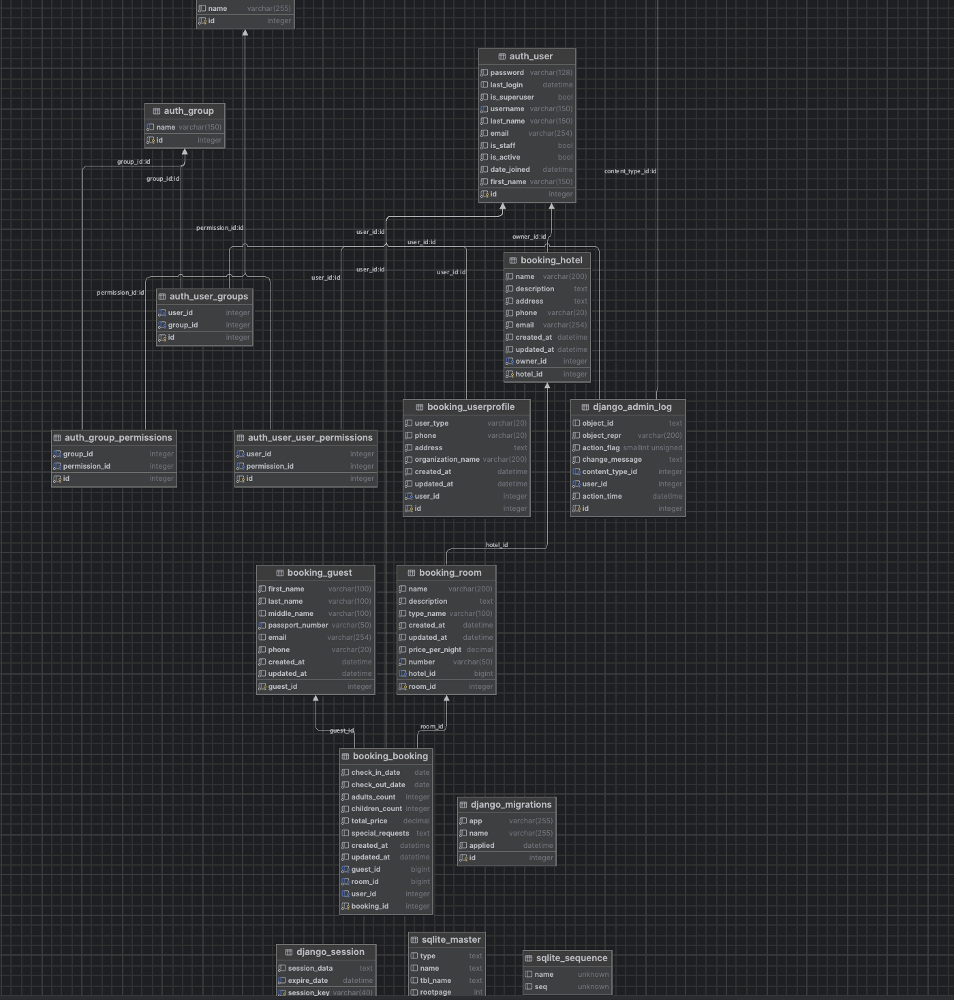
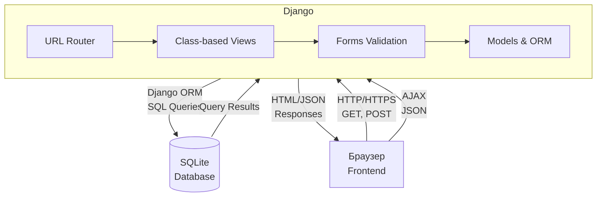

# Система онлайн-бронирования номеров отеля


Современное Django-приложение для управления бронированием номеров отеля с разделением ролей пользователей и организаций.

## 🚀 Возможности

### Для обычных пользователей:
- **Регистрация и авторизация** - создание личного аккаунта
- **Просмотр номеров** - просмотр доступных номеров с фильтрацией по типу и отелю
- **Проверка доступности** - проверка доступности номера на выбранные даты через AJAX
- **Расчет стоимости** - автоматический расчет стоимости проживания на основе дат
- **Бронирование** - создание бронирований с выбором существующего или созданием нового гостя
- **Личный кабинет** - просмотр своих бронирований и редактирование профиля

### Для организаций:
- **Регистрация организации** - создание аккаунта организации
- **Управление отелями** - создание и редактирование отелей
- **Управление номерами** - создание и редактирование номеров с указанием цены за ночь
- **Панель управления** - централизованная панель для управления всеми отелями и номерами

### Общие возможности:
- **Современный дизайн** - красивый интерфейс на Bootstrap 5 с градиентами и анимациями
- **Валидация данных** - проверка дат, предотвращение двойного бронирования
- **Админ-панель Django** - полнофункциональная административная панель
- **Защита от гонок** - использование транзакций для предотвращения конфликтов при бронировании

## 🛠 Технологии

- **Django 5.2.8** - веб-фреймворк
- **Django ORM** - работа с базой данных
- **Django Admin Panel** - административная панель
- **Class-based Views** - представления на основе классов
- **Bootstrap 5** - современный UI фреймворк
- **Bootstrap Icons** - иконки
- **AJAX/JSON** - асинхронные запросы для проверки доступности
- **SQLite** - база данных (по умолчанию)

## 📦 Установка и запуск

### 1. Клонирование репозитория (если необходимо)
```bash
git clone <repository-url>
cd hotels
```

### 2. Создание виртуального окружения
```bash
python3 -m venv venv
source venv/bin/activate  # На Windows: venv\Scripts\activate
```

### 3. Установка зависимостей
```bash
pip install -r requirements.txt
```

### 4. Применение миграций
```bash
python manage.py migrate
```

### 5. Создание суперпользователя
```bash
python manage.py createsuperuser
```

### 6. Запуск сервера разработки
```bash
python manage.py runserver
```

### 7. Открытие в браузере
- **Главная страница**: http://127.0.0.1:8000/
- **Админ-панель**: http://127.0.0.1:8000/admin/

## 📁 Структура проекта

```
hotels/
├── booking/                    # Основное приложение
│   ├── models.py              # Модели: UserProfile, Hotel, Room, Guest, Booking
│   ├── views.py               # Class-based views и AJAX endpoints
│   ├── forms.py               # Формы для регистрации, бронирования, отелей
│   ├── admin.py               # Настройки админ-панели
│   ├── urls.py                # URL маршруты приложения
│   └── migrations/            # Миграции базы данных
├── hotel_booking/             # Настройки проекта
│   ├── settings.py            # Конфигурация Django
│   └── urls.py                # Главные URL маршруты
├── templates/                 # HTML шаблоны
│   └── booking/              # Шаблоны приложения
│       ├── base.html         # Базовый шаблон
│       ├── home.html         # Главная страница
│       ├── rooms.html        # Список номеров
│       ├── room_detail.html  # Детали номера с проверкой доступности
│       ├── booking_form.html # Форма бронирования
│       ├── profile.html       # Личный кабинет
│       ├── organization_panel.html # Панель организации
│       └── ...               # Другие шаблоны
├── static/                    # Статические файлы
│   └── css/
│       └── custom.css        # Пользовательские стили
├── requirements.txt           # Зависимости проекта
└── manage.py                 # Управляющий скрипт Django
```

## 📸 Скриншоты приложения

### Главная страница


### Список номеров


### Детали номера


### Форма бронирования


### Личный кабинет


## 📊 ER-диаграмма базы данных

## 📊 Модели данных

### UserProfile (Профиль пользователя)
Расширяет стандартную модель User Django:
- `user` - связь с пользователем (OneToOne)
- `user_type` - тип пользователя ('user' или 'organization')
- `phone` - телефон
- `address` - адрес
- `organization_name` - название организации (для организаций)
- `created_at`, `updated_at` - даты создания и обновления

### Hotel (Отель)
- `hotel_id` - идентификатор
- `name` - название отеля
- `description` - описание
- `address` - адрес
- `phone` - телефон
- `email` - электронная почта
- `owner` - владелец (ForeignKey к User)
- `created_at`, `updated_at` - даты создания и обновления

### Room (Номер)
- `room_id` - идентификатор
- `hotel` - связь с отелем (ForeignKey)
- `number` - номер комнаты
- `name` - название номера
- `description` - описание
- `type_name` - тип комнаты
- `price_per_night` - цена за ночь
- `created_at`, `updated_at` - даты создания и обновления
- **Метод**: `calculate_price(check_in_date, check_out_date)` - расчет стоимости

### Guest (Гость)
- `guest_id` - идентификатор
- `first_name`, `last_name`, `middle_name` - ФИО
- `passport_number` - номер паспорта (уникальный)
- `email` - электронная почта
- `phone` - телефон
- `created_at`, `updated_at` - даты создания и обновления
- **Свойство**: `full_name` - полное имя

### Booking (Бронирование)
- `booking_id` - идентификатор
- `user` - пользователь, создавший бронирование (ForeignKey)
- `guest` - гость (ForeignKey)
- `room` - номер (ForeignKey)
- `check_in_date`, `check_out_date` - даты заезда и выезда
- `adults_count`, `children_count` - количество гостей
- `total_price` - стоимость проживания (автоматически рассчитывается)
- `special_requests` - пожелания
- `created_at`, `updated_at` - даты создания и обновления
- **Валидация**: проверка дат, предотвращение пересечений бронирований

## 🌐 Страницы сайта

### Публичные страницы:
- **Главная** (`/`) - обзор системы, статистика, популярные номера
- **Номера** (`/rooms/`) - список всех номеров с фильтрацией
- **Детали номера** (`/rooms/<id>/`) - подробная информация, проверка доступности
- **Контакты** (`/contact/`) - контактная информация

### Аутентификация:
- **Выбор типа регистрации** (`/register/`) - выбор между пользователем и организацией
- **Регистрация пользователя** (`/register/user/`)
- **Регистрация организации** (`/register/organization/`)
- **Вход** (`/login/`)
- **Выход** (`/logout/`)

### Личный кабинет пользователя:
- **Профиль** (`/profile/`) - просмотр и редактирование профиля, список бронирований

### Панель организации:
- **Панель управления** (`/organization/`) - список отелей и номеров
- **Создание отеля** (`/organization/hotels/create/`)
- **Редактирование отеля** (`/organization/hotels/<id>/edit/`)
- **Создание номера** (`/organization/rooms/create/`)
- **Редактирование номера** (`/organization/rooms/<id>/edit/`)

### Бронирования:
- **Список бронирований** (`/bookings/`)
- **Создание бронирования** (`/bookings/create/`) - с выбором/созданием гостя
- **Детали бронирования** (`/bookings/<id>/`)

### Гости:
- **Список гостей** (`/guests/`)
- **Создание гостя** (`/guests/create/`)
- **Детали гостя** (`/guests/<id>/`)

## 🏗 Архитектура системы



> **Подробная архитектурная схема:** см. [`docs/architecture.md`](docs/architecture.md)

## 🔌 API Документация

Система предоставляет AJAX endpoint для проверки доступности номеров.

### Endpoint: Проверка доступности номера

**GET** `/rooms/<room_id>/check-availability/`

**Параметры:**
- `check_in` (string, YYYY-MM-DD) - Дата заезда
- `check_out` (string, YYYY-MM-DD) - Дата выезда

**Пример запроса:**
```http
GET /rooms/1/check-availability/?check_in=2025-12-10&check_out=2025-12-15
```

**Успешный ответ (200 OK):**
```json
{
  "available": true,
  "nights": 5,
  "total_price": 15000.00,
  "price_per_night": 3000.00
}
```

**Если номер занят:**
```json
{
  "available": false,
  "nights": 5,
  "total_price": 15000.00,
  "price_per_night": 3000.00,
  "booking_dates": [
    {
      "check_in": "10.12.2025",
      "check_out": "15.12.2025"
    }
  ]
}
```

> **Полная документация API:** см. [`docs/API.md`](docs/API.md)  
> **Postman коллекция:** [`docs/Hotel_Booking_API.postman_collection.json`](docs/Hotel_Booking_API.postman_collection.json)

## 👥 Типы пользователей

### Обычный пользователь (`user_type='user'`):
- Может просматривать номера
- Может создавать бронирования
- Имеет личный кабинет с историей бронирований
- Может редактировать свой профиль

### Организация (`user_type='organization'`):
- Может создавать и редактировать отели
- Может создавать и редактировать номера
- Имеет панель управления для всех своих отелей
- Может устанавливать цены за ночь для номеров

## 📝 Зависимости

Основные зависимости указаны в `requirements.txt`:
- Django>=4.2.0

Остальные зависимости (Bootstrap, Bootstrap Icons) подключаются через CDN в шаблонах.

## 📚 Дополнительная документация

- **ER-диаграмма базы данных:** [`docs/database_schema.dbml`](docs/database_schema.dbml) (формат dbdiagram.io)
- **Инструкция для draw.io:** [`docs/drawio_instructions.md`](docs/drawio_instructions.md) (как создать ER-диаграмму в draw.io)
- **Архитектурная схема:** [`docs/architecture.md`](docs/architecture.md)
- **API документация:** [`docs/API.md`](docs/API.md)
- **Postman коллекция:** [`docs/Hotel_Booking_API.postman_collection.json`](docs/Hotel_Booking_API.postman_collection.json)
- **OpenAPI микросервисов (целевая архитектура):** [`docs/openapi-booking-service.yaml`](docs/openapi-booking-service.yaml), [`docs/openapi-payment-service.yaml`](docs/openapi-payment-service.yaml), [`docs/openapi-notification-service.yaml`](docs/openapi-notification-service.yaml)
- **Сводка API микросервисов (минимум 4 ручки на сервис):** [`docs/microservices_api.md`](docs/microservices_api.md) — эндпоинты, запуск трёх сервисов (Django Booking, Payment, Notification) и переменные окружения для связки (итоговый готовый вариант).

## 🔒 Валидация данных

### Бронирования:
- Дата заезда должна быть раньше даты выезда
- Дата заезда не может быть в прошлом
- Номер не может быть забронирован дважды на пересекающиеся даты
- Количество взрослых должно быть не менее 1
- Количество детей не может быть отрицательным

### Гости:
- Номер паспорта должен быть уникальным

### Номера:
- Номер комнаты должен быть уникальным в рамках отеля

## 🎨 Особенности интерфейса

- **Современный дизайн** с градиентами и тенями
- **Адаптивная верстка** для всех устройств
- **AJAX-запросы** для проверки доступности без перезагрузки страницы
- **Динамические формы** - показ/скрытие полей в зависимости от выбора
- **Валидация в реальном времени** с понятными сообщениями об ошибках
- **Иконки Bootstrap Icons** для улучшения UX

## 🔧 Технические особенности

### Защита от гонок (Race Conditions):
При создании бронирования используется:
- `transaction.atomic()` - атомарные транзакции
- `select_for_update()` - блокировка строк в БД

### Автоматический расчет стоимости:
- Стоимость рассчитывается автоматически при сохранении бронирования
- Формула: `price_per_night * количество_ночей`

### Проверка доступности:
- AJAX endpoint: `/rooms/<room_id>/check-availability/`
- Возвращает JSON с информацией о доступности и стоимости
- Показывает конфликтующие даты, если номер занят

## 🗄 Админ-панель

Админ-панель Django предоставляет полный функционал для управления:
- Пользователями и профилями
- Отелями
- Номерами
- Гостями
- Бронированиями

Доступ: http://127.0.0.1:8000/admin/

## 🚦 Разработка

### Основные принципы:
- **Class-based Views** для всех представлений
- **Django ORM** для работы с базой данных
- **Django Forms** для обработки пользовательского ввода
- **Signals** для автоматического создания профилей
- **Bootstrap 5** для стилизации интерфейса

### Создание миграций:
```bash
python manage.py makemigrations
python manage.py migrate
```

### Сбор статических файлов (для production):
```bash
python manage.py collectstatic
```

## 📄 Лицензия

Этот проект создан в образовательных целях.

## 🤝 Поддержка

При возникновении проблем:
1. Проверьте консоль браузера на наличие JavaScript ошибок
2. Проверьте логи Django сервера
3. Убедитесь, что все миграции применены
4. Проверьте, что создан суперпользователь для доступа к админ-панели


